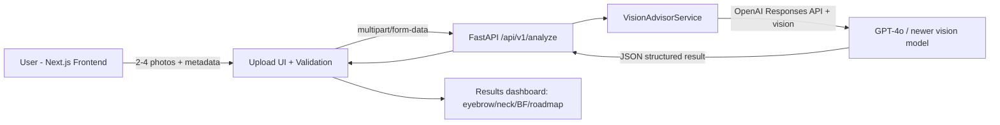

# Vanity AI Advisor

## High-level architecture



## Suggested folder structure

```text
.
├── backend
│   ├── app
│   │   ├── api
│   │   │   └── routes.py
│   │   ├── core
│   │   │   └── config.py
│   │   ├── schemas
│   │   │   └── analysis.py
│   │   ├── services
│   │   │   └── vision_advisor.py
│   │   └── main.py
│   └── requirements.txt
├── frontend
│   ├── app
│   │   ├── globals.css
│   │   ├── layout.tsx
│   │   └── page.tsx
│   ├── components
│   │   ├── ResultCards.tsx
│   │   └── UploadForm.tsx
│   ├── lib
│   │   └── api.ts
│   ├── types
│   │   └── analysis.ts
│   └── package.json
└── .env.example
```

## Environment variables

See `.env.example` for all required variables, including `OPENAI_MODEL_FALLBACK` used when the primary model is rate-limited or returns 5xx.

## Run backend locally

```bash
cd backend
pip install -r requirements.txt
uvicorn app.main:app --reload --port 8000
```

## Run frontend locally

```bash
cd frontend
npm install
npm run dev
```

## Implemented now

- FastAPI backend with `POST /api/v1/analyze` multipart endpoint.
- Validation for 2-4 images, file types, max file size.
- Optional body metadata fields (`height_cm`, `weight_kg`, `age`, `gender`, `goals`).
- OpenAI GPT-4o vision call using Structured Outputs (`response_format=json_schema`, strict mode) with graceful fallback to JSON mode when unavailable.
- Primary/fallback model handling (`OPENAI_MODEL` + `OPENAI_MODEL_FALLBACK`) for 429/5xx resilience.
- Next.js 14 App Router frontend with Tailwind clean components:
  - multi-file upload/drop input with thumbnail previews,
  - optional demographic/goals form fields with metric or imperial body stats,
  - submit flow to backend `/api/v1/analyze`,
  - loading/error states,
  - structured result cards for body-fat estimate, eyebrow/neck/symmetry insights, roadmap, and safety notes.
- v2 placeholder note for progress photo timeline/tracking.
- CORS + request rate limiting + health endpoint.
